# Beach Rough to Jungle Rough

_Generated on 2024-12-09 15:09:37_

## Top

### Tiles

| Tile | ID Hex | ID Dec | Alt Mod | Chance |
|:----:|:------:|:------:|:--------:|:------:|
| 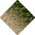 | 0x0284 | 644 | 0 | 100% |

### Statics

_None_

## Left

### Tiles

| Tile | ID Hex | ID Dec | Alt Mod | Chance |
|:----:|:------:|:------:|:--------:|:------:|
| 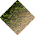 | 0x0285 | 645 | 0 | 100% |

### Statics

_None_

## Right

### Tiles

| Tile | ID Hex | ID Dec | Alt Mod | Chance |
|:----:|:------:|:------:|:--------:|:------:|
| 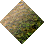 | 0x0283 | 643 | 0 | 100% |

### Statics

_None_

## Bottom

### Tiles

| Tile | ID Hex | ID Dec | Alt Mod | Chance |
|:----:|:------:|:------:|:--------:|:------:|
| 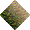 | 0x0282 | 642 | 0 | 100% |

### Statics

_None_

## Bottom Right

### Tiles

| Tile | ID Hex | ID Dec | Alt Mod | Chance |
|:----:|:------:|:------:|:--------:|:------:|
| 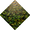 | 0x0287 | 647 | 0 | 100% |

### Statics

_None_

## Top Left

### Tiles

| Tile | ID Hex | ID Dec | Alt Mod | Chance |
|:----:|:------:|:------:|:--------:|:------:|
| 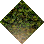 | 0x0286 | 646 | 0 | 100% |

### Statics

_None_

## Bottom Left

### Tiles

| Tile | ID Hex | ID Dec | Alt Mod | Chance |
|:----:|:------:|:------:|:--------:|:------:|
| 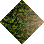 | 0x0288 | 648 | 0 | 100% |

### Statics

_None_

## Top Right

### Tiles

| Tile | ID Hex | ID Dec | Alt Mod | Chance |
|:----:|:------:|:------:|:--------:|:------:|
| 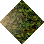 | 0x0289 | 649 | 0 | 100% |

### Statics

_None_

## Outer Top Left

### Tiles

| Tile | ID Hex | ID Dec | Alt Mod | Chance |
|:----:|:------:|:------:|:--------:|:------:|
| 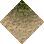 | 0x028A | 650 | 0 | 100% |

### Statics

_None_

## Outer Bottom Right

### Tiles

| Tile | ID Hex | ID Dec | Alt Mod | Chance |
|:----:|:------:|:------:|:--------:|:------:|
| 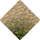 | 0x028B | 651 | 0 | 100% |

### Statics

_None_

## Outer Top Right

### Tiles

| Tile | ID Hex | ID Dec | Alt Mod | Chance |
|:----:|:------:|:------:|:--------:|:------:|
| 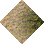 | 0x028C | 652 | 0 | 100% |

### Statics

_None_

## Outer Bottom Left

### Tiles

| Tile | ID Hex | ID Dec | Alt Mod | Chance |
|:----:|:------:|:------:|:--------:|:------:|
| 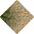 | 0x028D | 653 | 0 | 100% |

### Statics

_None_

## Autocorrect

### Tiles

| Tile | ID Hex | ID Dec | Alt Mod | Chance |
|:----:|:------:|:------:|:--------:|:------:|
|  | 0x00AC | 172 | 0 | 25% |
|  | 0x00AD | 173 | 0 | 25% |
|  | 0x00AE | 174 | 0 | 25% |
|  | 0x00AF | 175 | 0 | 25% |

### Statics

_None_

## Invalid

### Tiles

| Tile | ID Hex | ID Dec | Alt Mod | Chance |
|:----:|:------:|:------:|:--------:|:------:|
|  | 0x0016 | 22 | 0 | 25% |
|  | 0x0017 | 23 | 0 | 25% |
|  | 0x0018 | 24 | 0 | 25% |
|  | 0x0019 | 25 | 0 | 25% |

### Statics

_None_
