# Beach Rough to Planks EW

_Generated on 2024-12-09 21:21:00_

## Top

### Tiles

| Tile | ID Hex | ID Dec | Alt Mod | Chance |
|:----:|:------:|:------:|:-------:|:------:|
| 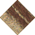 | 0x0298 | 664 | 0 | 50% |
| 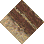 | 0x0299 | 665 | 0 | 50% |

### Statics

_None_

## Left

### Tiles

| Tile | ID Hex | ID Dec | Alt Mod | Chance |
|:----:|:------:|:------:|:-------:|:------:|
| 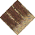 | 0x029C | 668 | 0 | 50% |
| 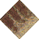 | 0x029D | 669 | 0 | 50% |

### Statics

_None_

## Right

### Tiles

| Tile | ID Hex | ID Dec | Alt Mod | Chance |
|:----:|:------:|:------:|:-------:|:------:|
| 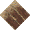 | 0x029E | 670 | 0 | 50% |
| 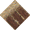 | 0x029F | 671 | 0 | 50% |

### Statics

_None_

## Bottom

### Tiles

| Tile | ID Hex | ID Dec | Alt Mod | Chance |
|:----:|:------:|:------:|:-------:|:------:|
| 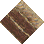 | 0x029A | 666 | 0 | 50% |
| 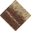 | 0x029B | 667 | 0 | 50% |

### Statics

_None_

## Bottom Right

### Tiles

| Tile | ID Hex | ID Dec | Alt Mod | Chance |
|:----:|:------:|:------:|:-------:|:------:|
| 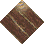 | 0x02A7 | 679 | 0 | 100% |

### Statics

_None_

## Top Left

### Tiles

| Tile | ID Hex | ID Dec | Alt Mod | Chance |
|:----:|:------:|:------:|:-------:|:------:|
| 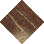 | 0x02A5 | 677 | 0 | 100% |

### Statics

_None_

## Bottom Left

### Tiles

| Tile | ID Hex | ID Dec | Alt Mod | Chance |
|:----:|:------:|:------:|:-------:|:------:|
| 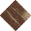 | 0x02BB | 699 | 0 | 100% |

### Statics

_None_

## Top Right

### Tiles

| Tile | ID Hex | ID Dec | Alt Mod | Chance |
|:----:|:------:|:------:|:-------:|:------:|
| 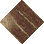 | 0x02A6 | 678 | 0 | 100% |

### Statics

_None_

## Outer Top Left

### Tiles

| Tile | ID Hex | ID Dec | Alt Mod | Chance |
|:----:|:------:|:------:|:-------:|:------:|
| 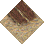 | 0x02A3 | 675 | 0 | 100% |

### Statics

_None_

## Outer Bottom Right

### Tiles

| Tile | ID Hex | ID Dec | Alt Mod | Chance |
|:----:|:------:|:------:|:-------:|:------:|
| 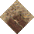 | 0x02A1 | 673 | 0 | 100% |

### Statics

_None_

## Outer Top Right

### Tiles

| Tile | ID Hex | ID Dec | Alt Mod | Chance |
|:----:|:------:|:------:|:-------:|:------:|
| 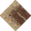 | 0x02A0 | 672 | 0 | 100% |

### Statics

_None_

## Outer Bottom Left

### Tiles

| Tile | ID Hex | ID Dec | Alt Mod | Chance |
|:----:|:------:|:------:|:-------:|:------:|
| 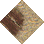 | 0x02A2 | 674 | 0 | 100% |

### Statics

_None_

## Autocorrect

### Tiles

| Tile | ID Hex | ID Dec | Alt Mod | Chance |
|:----:|:------:|:------:|:-------:|:------:|
| 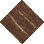 | 0x0296 | 662 | 0 | 75% |
| 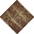 | 0x02A4 | 676 | 0 | 25% |

### Statics

_None_

## Invalid

### Tiles

| Tile | ID Hex | ID Dec | Alt Mod | Chance |
|:----:|:------:|:------:|:-------:|:------:|
|  | 0x0016 | 22 | 0 | 25% |
|  | 0x0017 | 23 | 0 | 25% |
|  | 0x0018 | 24 | 0 | 25% |
|  | 0x0019 | 25 | 0 | 25% |

### Statics

_None_
