# Beach to Dirt Large

_Generated on 2024-12-09 14:50:49_

## Top

### Tiles

| Tile | ID Hex | ID Dec | Alt Mod | Chance |
|:----:|:------:|:------:|:--------:|:------:|
| 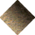 | 0x0338 | 824 | 0 | 100% |

### Statics

_None_

## Left

### Tiles

| Tile | ID Hex | ID Dec | Alt Mod | Chance |
|:----:|:------:|:------:|:--------:|:------:|
| 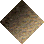 | 0x0337 | 823 | 0 | 100% |

### Statics

_None_

## Right

### Tiles

| Tile | ID Hex | ID Dec | Alt Mod | Chance |
|:----:|:------:|:------:|:--------:|:------:|
| 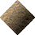 | 0x0336 | 822 | 0 | 100% |

### Statics

_None_

## Bottom

### Tiles

| Tile | ID Hex | ID Dec | Alt Mod | Chance |
|:----:|:------:|:------:|:--------:|:------:|
| 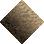 | 0x0335 | 821 | 0 | 100% |

### Statics

_None_

## Bottom Right

### Tiles

| Tile | ID Hex | ID Dec | Alt Mod | Chance |
|:----:|:------:|:------:|:--------:|:------:|
| 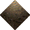 | 0x033D | 829 | 0 | 100% |

### Statics

_None_

## Top Left

### Tiles

| Tile | ID Hex | ID Dec | Alt Mod | Chance |
|:----:|:------:|:------:|:--------:|:------:|
| 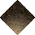 | 0x033E | 830 | 0 | 100% |

### Statics

_None_

## Bottom Left

### Tiles

| Tile | ID Hex | ID Dec | Alt Mod | Chance |
|:----:|:------:|:------:|:--------:|:------:|
| 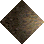 | 0x033F | 831 | 0 | 100% |

### Statics

_None_

## Top Right

### Tiles

| Tile | ID Hex | ID Dec | Alt Mod | Chance |
|:----:|:------:|:------:|:--------:|:------:|
| 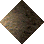 | 0x0340 | 832 | 0 | 100% |

### Statics

_None_

## Outer Top Left

### Tiles

| Tile | ID Hex | ID Dec | Alt Mod | Chance |
|:----:|:------:|:------:|:--------:|:------:|
| 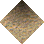 | 0x0339 | 825 | 0 | 100% |

### Statics

_None_

## Outer Bottom Right

### Tiles

| Tile | ID Hex | ID Dec | Alt Mod | Chance |
|:----:|:------:|:------:|:--------:|:------:|
| 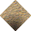 | 0x033A | 826 | 0 | 100% |

### Statics

_None_

## Outer Top Right

### Tiles

| Tile | ID Hex | ID Dec | Alt Mod | Chance |
|:----:|:------:|:------:|:--------:|:------:|
| 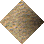 | 0x033B | 827 | 0 | 100% |

### Statics

_None_

## Outer Bottom Left

### Tiles

| Tile | ID Hex | ID Dec | Alt Mod | Chance |
|:----:|:------:|:------:|:--------:|:------:|
| 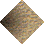 | 0x033C | 828 | 0 | 100% |

### Statics

_None_

## Autocorrect

### Tiles

| Tile | ID Hex | ID Dec | Alt Mod | Chance |
|:----:|:------:|:------:|:--------:|:------:|
|  | 0x0071 | 113 | 0 | 25% |
|  | 0x0072 | 114 | 0 | 25% |
|  | 0x0073 | 115 | 0 | 25% |
|  | 0x0074 | 116 | 0 | 25% |

### Statics

_None_

## Invalid

### Tiles

| Tile | ID Hex | ID Dec | Alt Mod | Chance |
|:----:|:------:|:------:|:--------:|:------:|
|  | 0x0016 | 22 | 0 | 25% |
|  | 0x0017 | 23 | 0 | 25% |
|  | 0x0018 | 24 | 0 | 25% |
|  | 0x0019 | 25 | 0 | 25% |

### Statics

_None_
