# Beach to Forest Yew

_Generated on 2024-12-09 14:50:49_

## Top

### Tiles

| Tile | ID Hex | ID Dec | Alt Mod | Chance |
|:----:|:------:|:------:|:--------:|:------:|
| 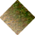 | 0x064E | 1614 | 0 | 100% |

### Statics

_None_

## Left

### Tiles

| Tile | ID Hex | ID Dec | Alt Mod | Chance |
|:----:|:------:|:------:|:--------:|:------:|
| 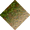 | 0x064D | 1613 | 0 | 100% |

### Statics

_None_

## Right

### Tiles

| Tile | ID Hex | ID Dec | Alt Mod | Chance |
|:----:|:------:|:------:|:--------:|:------:|
| 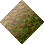 | 0x064C | 1612 | 0 | 100% |

### Statics

_None_

## Bottom

### Tiles

| Tile | ID Hex | ID Dec | Alt Mod | Chance |
|:----:|:------:|:------:|:--------:|:------:|
| 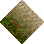 | 0x064B | 1611 | 0 | 100% |

### Statics

_None_

## Bottom Right

### Tiles

| Tile | ID Hex | ID Dec | Alt Mod | Chance |
|:----:|:------:|:------:|:--------:|:------:|
| 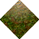 | 0x0653 | 1619 | 0 | 100% |

### Statics

_None_

## Top Left

### Tiles

| Tile | ID Hex | ID Dec | Alt Mod | Chance |
|:----:|:------:|:------:|:--------:|:------:|
| 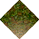 | 0x0654 | 1620 | 0 | 100% |

### Statics

_None_

## Bottom Left

### Tiles

| Tile | ID Hex | ID Dec | Alt Mod | Chance |
|:----:|:------:|:------:|:--------:|:------:|
| 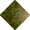 | 0x0655 | 1621 | 0 | 100% |

### Statics

_None_

## Top Right

### Tiles

| Tile | ID Hex | ID Dec | Alt Mod | Chance |
|:----:|:------:|:------:|:--------:|:------:|
| 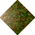 | 0x0656 | 1622 | 0 | 100% |

### Statics

_None_

## Outer Top Left

### Tiles

| Tile | ID Hex | ID Dec | Alt Mod | Chance |
|:----:|:------:|:------:|:--------:|:------:|
| 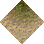 | 0x064F | 1615 | 0 | 100% |

### Statics

_None_

## Outer Bottom Right

### Tiles

| Tile | ID Hex | ID Dec | Alt Mod | Chance |
|:----:|:------:|:------:|:--------:|:------:|
| 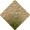 | 0x0650 | 1616 | 0 | 100% |

### Statics

_None_

## Outer Top Right

### Tiles

| Tile | ID Hex | ID Dec | Alt Mod | Chance |
|:----:|:------:|:------:|:--------:|:------:|
| 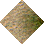 | 0x0651 | 1617 | 0 | 100% |

### Statics

_None_

## Outer Bottom Left

### Tiles

| Tile | ID Hex | ID Dec | Alt Mod | Chance |
|:----:|:------:|:------:|:--------:|:------:|
| 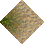 | 0x0652 | 1618 | 0 | 100% |

### Statics

_None_

## Autocorrect

### Tiles

| Tile | ID Hex | ID Dec | Alt Mod | Chance |
|:----:|:------:|:------:|:--------:|:------:|
|  | 0x00C4 | 196 | 0 | 25% |
|  | 0x00C5 | 197 | 0 | 25% |
|  | 0x00C6 | 198 | 0 | 25% |
|  | 0x00C7 | 199 | 0 | 25% |

### Statics

_None_

## Invalid

### Tiles

| Tile | ID Hex | ID Dec | Alt Mod | Chance |
|:----:|:------:|:------:|:--------:|:------:|
|  | 0x0016 | 22 | 0 | 25% |
|  | 0x0017 | 23 | 0 | 25% |
|  | 0x0018 | 24 | 0 | 25% |
|  | 0x0019 | 25 | 0 | 25% |

### Statics

_None_
