# Dirt Small to Brick EW

_Generated on 2024-12-09 21:21:04_

## Top

### Tiles

| Tile | ID Hex | ID Dec | Alt Mod | Chance |
|:----:|:------:|:------:|:-------:|:------:|
| 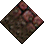 | 0x055A | 1370 | 0 | 100% |

### Statics

_None_

## Left

### Tiles

| Tile | ID Hex | ID Dec | Alt Mod | Chance |
|:----:|:------:|:------:|:-------:|:------:|
| 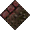 | 0x0559 | 1369 | 0 | 100% |

### Statics

_None_

## Right

### Tiles

| Tile | ID Hex | ID Dec | Alt Mod | Chance |
|:----:|:------:|:------:|:-------:|:------:|
| 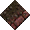 | 0x0558 | 1368 | 0 | 100% |

### Statics

_None_

## Bottom

### Tiles

| Tile | ID Hex | ID Dec | Alt Mod | Chance |
|:----:|:------:|:------:|:-------:|:------:|
| 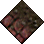 | 0x0557 | 1367 | 0 | 100% |

### Statics

_None_

## Bottom Right

### Tiles

| Tile | ID Hex | ID Dec | Alt Mod | Chance |
|:----:|:------:|:------:|:-------:|:------:|
| 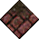 | 0x055F | 1375 | 0 | 100% |

### Statics

_None_

## Top Left

### Tiles

| Tile | ID Hex | ID Dec | Alt Mod | Chance |
|:----:|:------:|:------:|:-------:|:------:|
| 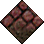 | 0x0560 | 1376 | 0 | 100% |

### Statics

_None_

## Bottom Left

### Tiles

| Tile | ID Hex | ID Dec | Alt Mod | Chance |
|:----:|:------:|:------:|:-------:|:------:|
| 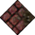 | 0x0561 | 1377 | 0 | 100% |

### Statics

_None_

## Top Right

### Tiles

| Tile | ID Hex | ID Dec | Alt Mod | Chance |
|:----:|:------:|:------:|:-------:|:------:|
| 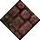 | 0x0562 | 1378 | 0 | 100% |

### Statics

_None_

## Outer Top Left

### Tiles

| Tile | ID Hex | ID Dec | Alt Mod | Chance |
|:----:|:------:|:------:|:-------:|:------:|
| 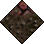 | 0x055D | 1373 | 0 | 100% |

### Statics

_None_

## Outer Bottom Right

### Tiles

| Tile | ID Hex | ID Dec | Alt Mod | Chance |
|:----:|:------:|:------:|:-------:|:------:|
| 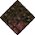 | 0x055E | 1374 | 0 | 100% |

### Statics

_None_

## Outer Top Right

### Tiles

| Tile | ID Hex | ID Dec | Alt Mod | Chance |
|:----:|:------:|:------:|:-------:|:------:|
| 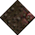 | 0x055B | 1371 | 0 | 100% |

### Statics

_None_

## Outer Bottom Left

### Tiles

| Tile | ID Hex | ID Dec | Alt Mod | Chance |
|:----:|:------:|:------:|:-------:|:------:|
| 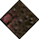 | 0x055C | 1372 | 0 | 100% |

### Statics

_None_

## Autocorrect

### Tiles

| Tile | ID Hex | ID Dec | Alt Mod | Chance |
|:----:|:------:|:------:|:-------:|:------:|
| 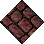 | 0x047E | 1150 | 0 | 25% |
| 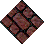 | 0x047F | 1151 | 0 | 25% |
| 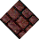 | 0x0484 | 1156 | 0 | 25% |
| 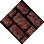 | 0x0485 | 1157 | 0 | 25% |

### Statics

_None_

## Invalid

### Tiles

| Tile | ID Hex | ID Dec | Alt Mod | Chance |
|:----:|:------:|:------:|:-------:|:------:|
|  | 0x0075 | 117 | 0 | 25% |
|  | 0x0076 | 118 | 0 | 25% |
|  | 0x0077 | 119 | 0 | 25% |
|  | 0x0078 | 120 | 0 | 25% |

### Statics

_None_
