# Dirt Small to Cobblestones

_Generated on 2024-12-09 21:21:04_

## Top

### Tiles

| Tile | ID Hex | ID Dec | Alt Mod | Chance |
|:----:|:------:|:------:|:-------:|:------:|
| 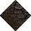 | 0x03FF | 1023 | 0 | 100% |

### Statics

_None_

## Left

### Tiles

| Tile | ID Hex | ID Dec | Alt Mod | Chance |
|:----:|:------:|:------:|:-------:|:------:|
| 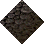 | 0x03FE | 1022 | 0 | 100% |

### Statics

_None_

## Right

### Tiles

| Tile | ID Hex | ID Dec | Alt Mod | Chance |
|:----:|:------:|:------:|:-------:|:------:|
| 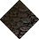 | 0x0400 | 1024 | 0 | 100% |

### Statics

_None_

## Bottom

### Tiles

| Tile | ID Hex | ID Dec | Alt Mod | Chance |
|:----:|:------:|:------:|:-------:|:------:|
| 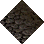 | 0x0401 | 1025 | 0 | 100% |

### Statics

_None_

## Bottom Right

### Tiles

| Tile | ID Hex | ID Dec | Alt Mod | Chance |
|:----:|:------:|:------:|:-------:|:------:|
| 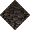 | 0x03FB | 1019 | 0 | 100% |

### Statics

_None_

## Top Left

### Tiles

| Tile | ID Hex | ID Dec | Alt Mod | Chance |
|:----:|:------:|:------:|:-------:|:------:|
| 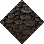 | 0x03FD | 1021 | 0 | 100% |

### Statics

_None_

## Bottom Left

### Tiles

| Tile | ID Hex | ID Dec | Alt Mod | Chance |
|:----:|:------:|:------:|:-------:|:------:|
| 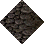 | 0x03FC | 1020 | 0 | 100% |

### Statics

_None_

## Top Right

### Tiles

| Tile | ID Hex | ID Dec | Alt Mod | Chance |
|:----:|:------:|:------:|:-------:|:------:|
| 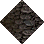 | 0x03FA | 1018 | 0 | 100% |

### Statics

_None_

## Outer Top Left

### Tiles

| Tile | ID Hex | ID Dec | Alt Mod | Chance |
|:----:|:------:|:------:|:-------:|:------:|
| 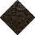 | 0x0403 | 1027 | 0 | 100% |

### Statics

_None_

## Outer Bottom Right

### Tiles

| Tile | ID Hex | ID Dec | Alt Mod | Chance |
|:----:|:------:|:------:|:-------:|:------:|
| 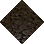 | 0x0405 | 1029 | 0 | 100% |

### Statics

_None_

## Outer Top Right

### Tiles

| Tile | ID Hex | ID Dec | Alt Mod | Chance |
|:----:|:------:|:------:|:-------:|:------:|
| 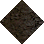 | 0x0404 | 1028 | 0 | 100% |

### Statics

_None_

## Outer Bottom Left

### Tiles

| Tile | ID Hex | ID Dec | Alt Mod | Chance |
|:----:|:------:|:------:|:-------:|:------:|
| 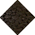 | 0x0402 | 1026 | 0 | 100% |

### Statics

_None_

## Autocorrect

### Tiles

| Tile | ID Hex | ID Dec | Alt Mod | Chance |
|:----:|:------:|:------:|:-------:|:------:|
|  | 0x03E9 | 1001 | 0 | 25% |
|  | 0x03EA | 1002 | 0 | 25% |
|  | 0x03EB | 1003 | 0 | 25% |
|  | 0x03EC | 1004 | 0 | 25% |

### Statics

_None_

## Invalid

### Tiles

| Tile | ID Hex | ID Dec | Alt Mod | Chance |
|:----:|:------:|:------:|:-------:|:------:|
|  | 0x0075 | 117 | 0 | 25% |
|  | 0x0076 | 118 | 0 | 25% |
|  | 0x0077 | 119 | 0 | 25% |
|  | 0x0078 | 120 | 0 | 25% |

### Statics

_None_
