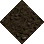
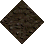
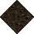
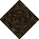
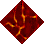
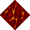
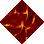
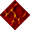

# Dirt Small to Lava

_Generated on 2024-12-09 21:21:04_

## Top

### Tiles

| Tile | ID Hex | ID Dec | Alt Mod | Chance |
|:----:|:------:|:------:|:-------:|:------:|
|  | 0x0075 | 117 | 0 | 25% |
|  | 0x0076 | 118 | 0 | 25% |
|  | 0x0077 | 119 | 0 | 25% |
|  | 0x0078 | 120 | 0 | 25% |

### Statics

| Tile | ID Hex | ID Dec | Alt Mod | Chance |
|:----:|:------:|:------:|:-------:|:------:|
|  | 0x32AC | 12972 | 0 | 50% |
|  | 0x32AD | 12973 | 0 | 50% |

## Left

### Tiles

| Tile | ID Hex | ID Dec | Alt Mod | Chance |
|:----:|:------:|:------:|:-------:|:------:|
|  | 0x0075 | 117 | 0 | 25% |
|  | 0x0076 | 118 | 0 | 25% |
|  | 0x0077 | 119 | 0 | 25% |
|  | 0x0078 | 120 | 0 | 25% |

### Statics

| Tile | ID Hex | ID Dec | Alt Mod | Chance |
|:----:|:------:|:------:|:-------:|:------:|
|  | 0x32B0 | 12976 | 0 | 50% |
|  | 0x32B1 | 12977 | 0 | 50% |

## Right

### Tiles

| Tile | ID Hex | ID Dec | Alt Mod | Chance |
|:----:|:------:|:------:|:-------:|:------:|
|  | 0x0075 | 117 | 0 | 25% |
|  | 0x0076 | 118 | 0 | 25% |
|  | 0x0077 | 119 | 0 | 25% |
|  | 0x0078 | 120 | 0 | 25% |

### Statics

| Tile | ID Hex | ID Dec | Alt Mod | Chance |
|:----:|:------:|:------:|:-------:|:------:|
|  | 0x32AA | 12970 | 0 | 50% |
|  | 0x32AB | 12971 | 0 | 50% |

## Bottom

### Tiles

| Tile | ID Hex | ID Dec | Alt Mod | Chance |
|:----:|:------:|:------:|:-------:|:------:|
|  | 0x0075 | 117 | 0 | 25% |
|  | 0x0076 | 118 | 0 | 25% |
|  | 0x0077 | 119 | 0 | 25% |
|  | 0x0078 | 120 | 0 | 25% |

### Statics

| Tile | ID Hex | ID Dec | Alt Mod | Chance |
|:----:|:------:|:------:|:-------:|:------:|
|  | 0x32AE | 12974 | 0 | 50% |
|  | 0x32AF | 12975 | 0 | 50% |

## Bottom Right

### Tiles

| Tile | ID Hex | ID Dec | Alt Mod | Chance |
|:----:|:------:|:------:|:-------:|:------:|
|  | 0x0075 | 117 | 0 | 25% |
|  | 0x0076 | 118 | 0 | 25% |
|  | 0x0077 | 119 | 0 | 25% |
|  | 0x0078 | 120 | 0 | 25% |

### Statics

| Tile | ID Hex | ID Dec | Alt Mod | Chance |
|:----:|:------:|:------:|:-------:|:------:|
|  | 0x32A2 | 12962 | 0 | 100% |

## Top Left

### Tiles

| Tile | ID Hex | ID Dec | Alt Mod | Chance |
|:----:|:------:|:------:|:-------:|:------:|
|  | 0x0075 | 117 | 0 | 25% |
|  | 0x0076 | 118 | 0 | 25% |
|  | 0x0077 | 119 | 0 | 25% |
|  | 0x0078 | 120 | 0 | 25% |

### Statics

| Tile | ID Hex | ID Dec | Alt Mod | Chance |
|:----:|:------:|:------:|:-------:|:------:|
|  | 0x32A4 | 12964 | 0 | 100% |

## Bottom Left

### Tiles

| Tile | ID Hex | ID Dec | Alt Mod | Chance |
|:----:|:------:|:------:|:-------:|:------:|
|  | 0x0075 | 117 | 0 | 25% |
|  | 0x0076 | 118 | 0 | 25% |
|  | 0x0077 | 119 | 0 | 25% |
|  | 0x0078 | 120 | 0 | 25% |

### Statics

| Tile | ID Hex | ID Dec | Alt Mod | Chance |
|:----:|:------:|:------:|:-------:|:------:|
|  | 0x32A5 | 12965 | 0 | 100% |

## Top Right

### Tiles

| Tile | ID Hex | ID Dec | Alt Mod | Chance |
|:----:|:------:|:------:|:-------:|:------:|
|  | 0x0075 | 117 | 0 | 25% |
|  | 0x0076 | 118 | 0 | 25% |
|  | 0x0077 | 119 | 0 | 25% |
|  | 0x0078 | 120 | 0 | 25% |

### Statics

| Tile | ID Hex | ID Dec | Alt Mod | Chance |
|:----:|:------:|:------:|:-------:|:------:|
|  | 0x32A3 | 12963 | 0 | 100% |

## Outer Top Left

### Tiles

| Tile | ID Hex | ID Dec | Alt Mod | Chance |
|:----:|:------:|:------:|:-------:|:------:|
|  | 0x0075 | 117 | 0 | 25% |
|  | 0x0076 | 118 | 0 | 25% |
|  | 0x0077 | 119 | 0 | 25% |
|  | 0x0078 | 120 | 0 | 25% |

### Statics

| Tile | ID Hex | ID Dec | Alt Mod | Chance |
|:----:|:------:|:------:|:-------:|:------:|
|  | 0x32A1 | 12961 | 0 | 50% |
|  | 0x32A7 | 12967 | 0 | 50% |

## Outer Bottom Right

### Tiles

| Tile | ID Hex | ID Dec | Alt Mod | Chance |
|:----:|:------:|:------:|:-------:|:------:|
|  | 0x0075 | 117 | 0 | 25% |
|  | 0x0076 | 118 | 0 | 25% |
|  | 0x0077 | 119 | 0 | 25% |
|  | 0x0078 | 120 | 0 | 25% |

### Statics

| Tile | ID Hex | ID Dec | Alt Mod | Chance |
|:----:|:------:|:------:|:-------:|:------:|
|  | 0x32A8 | 12968 | 0 | 100% |

## Outer Top Right

### Tiles

| Tile | ID Hex | ID Dec | Alt Mod | Chance |
|:----:|:------:|:------:|:-------:|:------:|
|  | 0x0075 | 117 | 0 | 25% |
|  | 0x0076 | 118 | 0 | 25% |
|  | 0x0077 | 119 | 0 | 25% |
|  | 0x0078 | 120 | 0 | 25% |

### Statics

| Tile | ID Hex | ID Dec | Alt Mod | Chance |
|:----:|:------:|:------:|:-------:|:------:|
|  | 0x32A0 | 12960 | 0 | 50% |
|  | 0x32A6 | 12966 | 0 | 50% |

## Outer Bottom Left

### Tiles

| Tile | ID Hex | ID Dec | Alt Mod | Chance |
|:----:|:------:|:------:|:-------:|:------:|
|  | 0x0075 | 117 | 0 | 25% |
|  | 0x0076 | 118 | 0 | 25% |
|  | 0x0077 | 119 | 0 | 25% |
|  | 0x0078 | 120 | 0 | 25% |

### Statics

| Tile | ID Hex | ID Dec | Alt Mod | Chance |
|:----:|:------:|:------:|:-------:|:------:|
|  | 0x329E | 12958 | 0 | 50% |
|  | 0x32A9 | 12969 | 0 | 50% |

## Autocorrect

### Tiles

| Tile | ID Hex | ID Dec | Alt Mod | Chance |
|:----:|:------:|:------:|:-------:|:------:|
|  | 0x01F4 | 500 | 0 | 25% |
|  | 0x01F5 | 501 | 0 | 25% |
|  | 0x01F6 | 502 | 0 | 25% |
|  | 0x01F7 | 503 | 0 | 25% |

### Statics

_None_

## Invalid

### Tiles

| Tile | ID Hex | ID Dec | Alt Mod | Chance |
|:----:|:------:|:------:|:-------:|:------:|
|  | 0x0075 | 117 | 0 | 25% |
|  | 0x0076 | 118 | 0 | 25% |
|  | 0x0077 | 119 | 0 | 25% |
|  | 0x0078 | 120 | 0 | 25% |

### Statics

_None_
