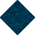
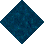
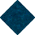

# Forest Cleared to Water

_Generated on 2024-12-09 15:09:40_

## Top

### Tiles

| Tile | ID Hex | ID Dec | Alt Mod | Chance |
|:----:|:------:|:------:|:--------:|:------:|
|  | 0x00C4 | 196 | 0 | 25% |
|  | 0x00C5 | 197 | 0 | 25% |
|  | 0x00C6 | 198 | 0 | 25% |
|  | 0x00C7 | 199 | 0 | 25% |

### Statics

| Tile | ID Hex | ID Dec | Alt Mod | Chance |
|:----:|:------:|:------:|:--------:|:------:|
|  | 0x17A1 | 6049 | 0 | 50% |
|  | 0x17A2 | 6050 | 0 | 50% |

## Left

### Tiles

| Tile | ID Hex | ID Dec | Alt Mod | Chance |
|:----:|:------:|:------:|:--------:|:------:|
|  | 0x00C4 | 196 | 0 | 25% |
|  | 0x00C5 | 197 | 0 | 25% |
|  | 0x00C6 | 198 | 0 | 25% |
|  | 0x00C7 | 199 | 0 | 25% |

### Statics

| Tile | ID Hex | ID Dec | Alt Mod | Chance |
|:----:|:------:|:------:|:--------:|:------:|
|  | 0x179D | 6045 | 0 | 50% |
|  | 0x179E | 6046 | 0 | 50% |

## Right

### Tiles

| Tile | ID Hex | ID Dec | Alt Mod | Chance |
|:----:|:------:|:------:|:--------:|:------:|
|  | 0x00C4 | 196 | 0 | 25% |
|  | 0x00C5 | 197 | 0 | 25% |
|  | 0x00C6 | 198 | 0 | 25% |
|  | 0x00C7 | 199 | 0 | 25% |

### Statics

| Tile | ID Hex | ID Dec | Alt Mod | Chance |
|:----:|:------:|:------:|:--------:|:------:|
|  | 0x17A3 | 6051 | 0 | 50% |
|  | 0x17A4 | 6052 | 0 | 50% |

## Bottom

### Tiles

| Tile | ID Hex | ID Dec | Alt Mod | Chance |
|:----:|:------:|:------:|:--------:|:------:|
|  | 0x00C4 | 196 | 0 | 25% |
|  | 0x00C5 | 197 | 0 | 25% |
|  | 0x00C6 | 198 | 0 | 25% |
|  | 0x00C7 | 199 | 0 | 25% |

### Statics

| Tile | ID Hex | ID Dec | Alt Mod | Chance |
|:----:|:------:|:------:|:--------:|:------:|
|  | 0x179F | 6047 | 0 | 50% |
|  | 0x17A0 | 6048 | 0 | 50% |

## Bottom Right

### Tiles

| Tile | ID Hex | ID Dec | Alt Mod | Chance |
|:----:|:------:|:------:|:--------:|:------:|
|  | 0x00C4 | 196 | 0 | 25% |
|  | 0x00C5 | 197 | 0 | 25% |
|  | 0x00C6 | 198 | 0 | 25% |
|  | 0x00C7 | 199 | 0 | 25% |

### Statics

| Tile | ID Hex | ID Dec | Alt Mod | Chance |
|:----:|:------:|:------:|:--------:|:------:|
|  | 0x17AC | 6060 | 0 | 100% |

## Top Left

### Tiles

| Tile | ID Hex | ID Dec | Alt Mod | Chance |
|:----:|:------:|:------:|:--------:|:------:|
|  | 0x00C4 | 196 | 0 | 25% |
|  | 0x00C5 | 197 | 0 | 25% |
|  | 0x00C6 | 198 | 0 | 25% |
|  | 0x00C7 | 199 | 0 | 25% |

### Statics

| Tile | ID Hex | ID Dec | Alt Mod | Chance |
|:----:|:------:|:------:|:--------:|:------:|
|  | 0x17AA | 6058 | 0 | 100% |

## Bottom Left

### Tiles

| Tile | ID Hex | ID Dec | Alt Mod | Chance |
|:----:|:------:|:------:|:--------:|:------:|
|  | 0x00C4 | 196 | 0 | 25% |
|  | 0x00C5 | 197 | 0 | 25% |
|  | 0x00C6 | 198 | 0 | 25% |
|  | 0x00C7 | 199 | 0 | 25% |

### Statics

| Tile | ID Hex | ID Dec | Alt Mod | Chance |
|:----:|:------:|:------:|:--------:|:------:|
|  | 0x17A9 | 6057 | 0 | 100% |

## Top Right

### Tiles

| Tile | ID Hex | ID Dec | Alt Mod | Chance |
|:----:|:------:|:------:|:--------:|:------:|
|  | 0x00C4 | 196 | 0 | 25% |
|  | 0x00C5 | 197 | 0 | 25% |
|  | 0x00C6 | 198 | 0 | 25% |
|  | 0x00C7 | 199 | 0 | 25% |

### Statics

| Tile | ID Hex | ID Dec | Alt Mod | Chance |
|:----:|:------:|:------:|:--------:|:------:|
|  | 0x17AB | 6059 | 0 | 100% |

## Outer Top Left

### Tiles

| Tile | ID Hex | ID Dec | Alt Mod | Chance |
|:----:|:------:|:------:|:--------:|:------:|
|  | 0x00C4 | 196 | 0 | 25% |
|  | 0x00C5 | 197 | 0 | 25% |
|  | 0x00C6 | 198 | 0 | 25% |
|  | 0x00C7 | 199 | 0 | 25% |

### Statics

| Tile | ID Hex | ID Dec | Alt Mod | Chance |
|:----:|:------:|:------:|:--------:|:------:|
|  | 0x17A7 | 6055 | 0 | 100% |

## Outer Bottom Right

### Tiles

| Tile | ID Hex | ID Dec | Alt Mod | Chance |
|:----:|:------:|:------:|:--------:|:------:|
|  | 0x00C4 | 196 | 0 | 25% |
|  | 0x00C5 | 197 | 0 | 25% |
|  | 0x00C6 | 198 | 0 | 25% |
|  | 0x00C7 | 199 | 0 | 25% |

### Statics

| Tile | ID Hex | ID Dec | Alt Mod | Chance |
|:----:|:------:|:------:|:--------:|:------:|
|  | 0x17A6 | 6054 | 0 | 50% |
|  | 0x17AF | 6063 | 0 | 50% |

## Outer Top Right

### Tiles

| Tile | ID Hex | ID Dec | Alt Mod | Chance |
|:----:|:------:|:------:|:--------:|:------:|
|  | 0x00C4 | 196 | 0 | 25% |
|  | 0x00C5 | 197 | 0 | 25% |
|  | 0x00C6 | 198 | 0 | 25% |
|  | 0x00C7 | 199 | 0 | 25% |

### Statics

| Tile | ID Hex | ID Dec | Alt Mod | Chance |
|:----:|:------:|:------:|:--------:|:------:|
|  | 0x17A8 | 6056 | 0 | 50% |
|  | 0x17B0 | 6064 | 0 | 50% |

## Outer Bottom Left

### Tiles

| Tile | ID Hex | ID Dec | Alt Mod | Chance |
|:----:|:------:|:------:|:--------:|:------:|
|  | 0x00C4 | 196 | 0 | 25% |
|  | 0x00C5 | 197 | 0 | 25% |
|  | 0x00C6 | 198 | 0 | 25% |
|  | 0x00C7 | 199 | 0 | 25% |

### Statics

| Tile | ID Hex | ID Dec | Alt Mod | Chance |
|:----:|:------:|:------:|:--------:|:------:|
|  | 0x17A5 | 6053 | 0 | 50% |
|  | 0x17B2 | 6066 | 0 | 50% |

## Autocorrect

### Tiles

| Tile | ID Hex | ID Dec | Alt Mod | Chance |
|:----:|:------:|:------:|:--------:|:------:|
|  | 0x00A8 | 168 | 0 | 25% |
|  | 0x00A9 | 169 | 0 | 25% |
|  | 0x00AA | 170 | 0 | 25% |
|  | 0x00AB | 171 | 0 | 25% |

### Statics

_None_

## Invalid

### Tiles

| Tile | ID Hex | ID Dec | Alt Mod | Chance |
|:----:|:------:|:------:|:--------:|:------:|
|  | 0x00C4 | 196 | 0 | 25% |
|  | 0x00C5 | 197 | 0 | 25% |
|  | 0x00C6 | 198 | 0 | 25% |
|  | 0x00C7 | 199 | 0 | 25% |

### Statics

_None_
