# Forest No Statics to Graveyard

_Generated on 2024-12-09 15:09:38_

## Top

### Tiles

| Tile | ID Hex | ID Dec | Alt Mod | Chance |
|:----:|:------:|:------:|:--------:|:------:|
| 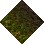 | 0x0165 | 357 | 0 | 100% |

### Statics

_None_

## Left

### Tiles

| Tile | ID Hex | ID Dec | Alt Mod | Chance |
|:----:|:------:|:------:|:--------:|:------:|
| 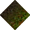 | 0x0166 | 358 | 0 | 100% |

### Statics

_None_

## Right

### Tiles

| Tile | ID Hex | ID Dec | Alt Mod | Chance |
|:----:|:------:|:------:|:--------:|:------:|
| 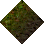 | 0x0167 | 359 | 0 | 100% |

### Statics

_None_

## Bottom

### Tiles

| Tile | ID Hex | ID Dec | Alt Mod | Chance |
|:----:|:------:|:------:|:--------:|:------:|
| 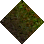 | 0x0168 | 360 | 0 | 100% |

### Statics

_None_

## Bottom Right

### Tiles

| Tile | ID Hex | ID Dec | Alt Mod | Chance |
|:----:|:------:|:------:|:--------:|:------:|
| 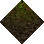 | 0x016B | 363 | 0 | 100% |

### Statics

_None_

## Top Left

### Tiles

| Tile | ID Hex | ID Dec | Alt Mod | Chance |
|:----:|:------:|:------:|:--------:|:------:|
| 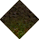 | 0x016C | 364 | 0 | 100% |

### Statics

_None_

## Bottom Left

### Tiles

| Tile | ID Hex | ID Dec | Alt Mod | Chance |
|:----:|:------:|:------:|:--------:|:------:|
| 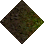 | 0x016A | 362 | 0 | 100% |

### Statics

_None_

## Top Right

### Tiles

| Tile | ID Hex | ID Dec | Alt Mod | Chance |
|:----:|:------:|:------:|:--------:|:------:|
| 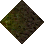 | 0x0169 | 361 | 0 | 100% |

### Statics

_None_

## Outer Top Left

### Tiles

| Tile | ID Hex | ID Dec | Alt Mod | Chance |
|:----:|:------:|:------:|:--------:|:------:|
| 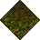 | 0x0163 | 355 | 0 | 100% |

### Statics

_None_

## Outer Bottom Right

### Tiles

| Tile | ID Hex | ID Dec | Alt Mod | Chance |
|:----:|:------:|:------:|:--------:|:------:|
| 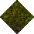 | 0x0164 | 356 | 0 | 100% |

### Statics

_None_

## Outer Top Right

### Tiles

| Tile | ID Hex | ID Dec | Alt Mod | Chance |
|:----:|:------:|:------:|:--------:|:------:|
| 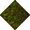 | 0x0162 | 354 | 0 | 100% |

### Statics

_None_

## Outer Bottom Left

### Tiles

| Tile | ID Hex | ID Dec | Alt Mod | Chance |
|:----:|:------:|:------:|:--------:|:------:|
| 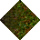 | 0x0161 | 353 | 0 | 100% |

### Statics

_None_

## Autocorrect

### Tiles

| Tile | ID Hex | ID Dec | Alt Mod | Chance |
|:----:|:------:|:------:|:--------:|:------:|
|  | 0x0075 | 117 | 0 | 25% |
|  | 0x0076 | 118 | 0 | 25% |
|  | 0x0077 | 119 | 0 | 25% |
|  | 0x0078 | 120 | 0 | 25% |

### Statics

_None_

## Invalid

### Tiles

| Tile | ID Hex | ID Dec | Alt Mod | Chance |
|:----:|:------:|:------:|:--------:|:------:|
|  | 0x00C4 | 196 | 0 | 25% |
|  | 0x00C5 | 197 | 0 | 25% |
|  | 0x00C6 | 198 | 0 | 25% |
|  | 0x00C7 | 199 | 0 | 25% |

### Statics

_None_
