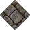
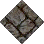

# Grass No Statics to Flagstone EW

_Generated on 2024-12-09 15:09:38_

## Top

### Tiles

| Tile | ID Hex | ID Dec | Alt Mod | Chance |
|:----:|:------:|:------:|:--------:|:------:|
|  | 0x0003 | 3 | 0 | 25% |
|  | 0x0004 | 4 | 0 | 25% |
|  | 0x0005 | 5 | 0 | 25% |
|  | 0x0006 | 6 | 0 | 25% |

### Statics

| Tile | ID Hex | ID Dec | Alt Mod | Chance |
|:----:|:------:|:------:|:--------:|:------:|
|  | 0x1784 | 6020 | 0 | 100% |

## Left

### Tiles

| Tile | ID Hex | ID Dec | Alt Mod | Chance |
|:----:|:------:|:------:|:--------:|:------:|
|  | 0x0003 | 3 | 0 | 25% |
|  | 0x0004 | 4 | 0 | 25% |
|  | 0x0005 | 5 | 0 | 25% |
|  | 0x0006 | 6 | 0 | 25% |

### Statics

| Tile | ID Hex | ID Dec | Alt Mod | Chance |
|:----:|:------:|:------:|:--------:|:------:|
|  | 0x1785 | 6021 | 0 | 100% |

## Right

### Tiles

| Tile | ID Hex | ID Dec | Alt Mod | Chance |
|:----:|:------:|:------:|:--------:|:------:|
|  | 0x0003 | 3 | 0 | 25% |
|  | 0x0004 | 4 | 0 | 25% |
|  | 0x0005 | 5 | 0 | 25% |
|  | 0x0006 | 6 | 0 | 25% |

### Statics

| Tile | ID Hex | ID Dec | Alt Mod | Chance |
|:----:|:------:|:------:|:--------:|:------:|
|  | 0x1783 | 6019 | 0 | 100% |

## Bottom

### Tiles

| Tile | ID Hex | ID Dec | Alt Mod | Chance |
|:----:|:------:|:------:|:--------:|:------:|
|  | 0x0003 | 3 | 0 | 25% |
|  | 0x0004 | 4 | 0 | 25% |
|  | 0x0005 | 5 | 0 | 25% |
|  | 0x0006 | 6 | 0 | 25% |

### Statics

| Tile | ID Hex | ID Dec | Alt Mod | Chance |
|:----:|:------:|:------:|:--------:|:------:|
|  | 0x1782 | 6018 | 0 | 100% |

## Bottom Right

### Tiles

| Tile | ID Hex | ID Dec | Alt Mod | Chance |
|:----:|:------:|:------:|:--------:|:------:|
|  | 0x0003 | 3 | 0 | 25% |
|  | 0x0004 | 4 | 0 | 25% |
|  | 0x0005 | 5 | 0 | 25% |
|  | 0x0006 | 6 | 0 | 25% |

### Statics

| Tile | ID Hex | ID Dec | Alt Mod | Chance |
|:----:|:------:|:------:|:--------:|:------:|
|  | 0x1789 | 6025 | 0 | 100% |

## Top Left

### Tiles

| Tile | ID Hex | ID Dec | Alt Mod | Chance |
|:----:|:------:|:------:|:--------:|:------:|
|  | 0x0003 | 3 | 0 | 25% |
|  | 0x0004 | 4 | 0 | 25% |
|  | 0x0005 | 5 | 0 | 25% |
|  | 0x0006 | 6 | 0 | 25% |

### Statics

| Tile | ID Hex | ID Dec | Alt Mod | Chance |
|:----:|:------:|:------:|:--------:|:------:|
|  | 0x1787 | 6023 | 0 | 100% |

## Bottom Left

### Tiles

| Tile | ID Hex | ID Dec | Alt Mod | Chance |
|:----:|:------:|:------:|:--------:|:------:|
|  | 0x0003 | 3 | 0 | 25% |
|  | 0x0004 | 4 | 0 | 25% |
|  | 0x0005 | 5 | 0 | 25% |
|  | 0x0006 | 6 | 0 | 25% |

### Statics

| Tile | ID Hex | ID Dec | Alt Mod | Chance |
|:----:|:------:|:------:|:--------:|:------:|
|  | 0x1786 | 6022 | 0 | 100% |

## Top Right

### Tiles

| Tile | ID Hex | ID Dec | Alt Mod | Chance |
|:----:|:------:|:------:|:--------:|:------:|
|  | 0x0003 | 3 | 0 | 25% |
|  | 0x0004 | 4 | 0 | 25% |
|  | 0x0005 | 5 | 0 | 25% |
|  | 0x0006 | 6 | 0 | 25% |

### Statics

| Tile | ID Hex | ID Dec | Alt Mod | Chance |
|:----:|:------:|:------:|:--------:|:------:|
|  | 0x1788 | 6024 | 0 | 100% |

## Outer Top Left, Outer Bottom Right, Outer Top Right, Outer Bottom Left, Invalid

### Tiles

| Tile | ID Hex | ID Dec | Alt Mod | Chance |
|:----:|:------:|:------:|:--------:|:------:|
|  | 0x0003 | 3 | 0 | 25% |
|  | 0x0004 | 4 | 0 | 25% |
|  | 0x0005 | 5 | 0 | 25% |
|  | 0x0006 | 6 | 0 | 25% |

### Statics

_None_

## Autocorrect

### Tiles

| Tile | ID Hex | ID Dec | Alt Mod | Chance |
|:----:|:------:|:------:|:--------:|:------:|
|  | 0x04EB | 1259 | 0 | 50% |
|  | 0x04ED | 1261 | 0 | 50% |

### Statics

_None_
