# Grass No Statics to Sandstone EW

_Generated on 2024-12-09 21:21:02_

## Top

### Tiles

| Tile | ID Hex | ID Dec | Alt Mod | Chance |
|:----:|:------:|:------:|:-------:|:------:|
| 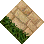 | 0x0468 | 1128 | 0 | 100% |

### Statics

_None_

## Left

### Tiles

| Tile | ID Hex | ID Dec | Alt Mod | Chance |
|:----:|:------:|:------:|:-------:|:------:|
| 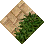 | 0x0462 | 1122 | 0 | 25% |
| 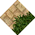 | 0x0463 | 1123 | 0 | 25% |
| 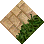 | 0x0464 | 1124 | 0 | 25% |
| 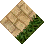 | 0x0465 | 1125 | 0 | 25% |

### Statics

_None_

## Right

### Tiles

| Tile | ID Hex | ID Dec | Alt Mod | Chance |
|:----:|:------:|:------:|:-------:|:------:|
| 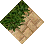 | 0x045E | 1118 | 0 | 25% |
| 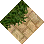 | 0x045F | 1119 | 0 | 25% |
| 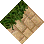 | 0x0460 | 1120 | 0 | 25% |
| 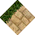 | 0x0461 | 1121 | 0 | 25% |

### Statics

_None_

## Bottom

### Tiles

| Tile | ID Hex | ID Dec | Alt Mod | Chance |
|:----:|:------:|:------:|:-------:|:------:|
| 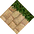 | 0x0459 | 1113 | 0 | 100% |

### Statics

_None_

## Bottom Right

### Tiles

| Tile | ID Hex | ID Dec | Alt Mod | Chance |
|:----:|:------:|:------:|:-------:|:------:|
| 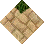 | 0x046E | 1134 | 0 | 100% |

### Statics

_None_

## Top Left

### Tiles

| Tile | ID Hex | ID Dec | Alt Mod | Chance |
|:----:|:------:|:------:|:-------:|:------:|
| 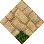 | 0x046D | 1133 | 0 | 100% |

### Statics

_None_

## Bottom Left

### Tiles

| Tile | ID Hex | ID Dec | Alt Mod | Chance |
|:----:|:------:|:------:|:-------:|:------:|
| 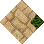 | 0x0466 | 1126 | 0 | 100% |

### Statics

_None_

## Top Right

### Tiles

| Tile | ID Hex | ID Dec | Alt Mod | Chance |
|:----:|:------:|:------:|:-------:|:------:|
| 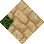 | 0x046F | 1135 | 0 | 100% |

### Statics

_None_

## Outer Top Left

### Tiles

| Tile | ID Hex | ID Dec | Alt Mod | Chance |
|:----:|:------:|:------:|:-------:|:------:|
| 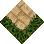 | 0x046C | 1132 | 0 | 100% |

### Statics

_None_

## Outer Bottom Right

### Tiles

| Tile | ID Hex | ID Dec | Alt Mod | Chance |
|:----:|:------:|:------:|:-------:|:------:|
| 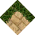 | 0x046B | 1131 | 0 | 100% |

### Statics

_None_

## Outer Top Right

### Tiles

| Tile | ID Hex | ID Dec | Alt Mod | Chance |
|:----:|:------:|:------:|:-------:|:------:|
| 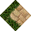 | 0x046A | 1130 | 0 | 100% |

### Statics

_None_

## Outer Bottom Left

### Tiles

| Tile | ID Hex | ID Dec | Alt Mod | Chance |
|:----:|:------:|:------:|:-------:|:------:|
| 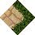 | 0x0469 | 1129 | 0 | 100% |

### Statics

_None_

## Autocorrect

### Tiles

| Tile | ID Hex | ID Dec | Alt Mod | Chance |
|:----:|:------:|:------:|:-------:|:------:|
| 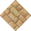 | 0x0446 | 1094 | 0 | 25% |
| 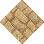 | 0x0447 | 1095 | 0 | 25% |
| 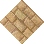 | 0x0448 | 1096 | 0 | 25% |
| 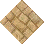 | 0x0449 | 1097 | 0 | 25% |

### Statics

_None_

## Invalid

### Tiles

| Tile | ID Hex | ID Dec | Alt Mod | Chance |
|:----:|:------:|:------:|:-------:|:------:|
|  | 0x0003 | 3 | 0 | 25% |
|  | 0x0004 | 4 | 0 | 25% |
|  | 0x0005 | 5 | 0 | 25% |
|  | 0x0006 | 6 | 0 | 25% |

### Statics

_None_
