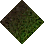
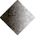

# Grass-Small Dirt

_Generated on 2024-12-09 21:21:05_

## Tiles

| Tile | ID Hex | ID Dec | Alt Mod | Chance |
|:----:|:------:|:------:|:-------:|:------:|
|  | 0x05C2 | 1474 | 0 | 100% |

## Statics

_None_

## Tiles

| Tile | ID Hex | ID Dec | Alt Mod | Chance |
|:----:|:------:|:------:|:-------:|:------:|
|  | 0x05C1 | 1473 | 0 | 100% |

## Statics

_None_

## Tiles

| Tile | ID Hex | ID Dec | Alt Mod | Chance |
|:----:|:------:|:------:|:-------:|:------:|
|  | 0x0387 | 903 | 0 | 100% |

## Statics

_None_

## Tiles

| Tile | ID Hex | ID Dec | Alt Mod | Chance |
|:----:|:------:|:------:|:-------:|:------:|
|  | 0x0388 | 904 | 0 | 100% |

## Statics

_None_

## Tiles

| Tile | ID Hex | ID Dec | Alt Mod | Chance |
|:----:|:------:|:------:|:-------:|:------:|
|  | 0x0386 | 902 | 0 | 100% |

## Statics

_None_

## Tiles

| Tile | ID Hex | ID Dec | Alt Mod | Chance |
|:----:|:------:|:------:|:-------:|:------:|
|  | 0x0086 | 134 | 0 | 100% |

## Statics

_None_

## Tiles

| Tile | ID Hex | ID Dec | Alt Mod | Chance |
|:----:|:------:|:------:|:-------:|:------:|
|  | 0x05C0 | 1472 | 0 | 100% |

## Statics

_None_

## Tiles

| Tile | ID Hex | ID Dec | Alt Mod | Chance |
|:----:|:------:|:------:|:-------:|:------:|
|  | 0x0089 | 137 | 0 | 100% |

## Statics

_None_

## Tiles

| Tile | ID Hex | ID Dec | Alt Mod | Chance |
|:----:|:------:|:------:|:-------:|:------:|
|  | 0x0385 | 901 | 0 | 100% |

## Statics

_None_

## Tiles

| Tile | ID Hex | ID Dec | Alt Mod | Chance |
|:----:|:------:|:------:|:-------:|:------:|
|  | 0x05BF | 1471 | 0 | 100% |

## Statics

_None_

## Tiles

| Tile | ID Hex | ID Dec | Alt Mod | Chance |
|:----:|:------:|:------:|:-------:|:------:|
|  | 0x0087 | 135 | 0 | 100% |

## Statics

_None_

## Tiles

| Tile | ID Hex | ID Dec | Alt Mod | Chance |
|:----:|:------:|:------:|:-------:|:------:|
|  | 0x0088 | 136 | 0 | 100% |

## Statics

_None_

## Tiles

| Tile | ID Hex | ID Dec | Alt Mod | Chance |
|:----:|:------:|:------:|:-------:|:------:|
|  | 0x0393 | 915 | 0 | 100% |

## Statics

_None_

## Tiles

| Tile | ID Hex | ID Dec | Alt Mod | Chance |
|:----:|:------:|:------:|:-------:|:------:|
|  | 0x008B | 139 | 0 | 100% |

## Statics

_None_
