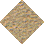
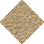
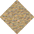
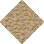

# Sand Rough to Stone Brown

_Generated on 2024-12-09 21:20:59_

## Top, Left, Right, Bottom, Bottom Right, Top Left, Bottom Left, Top Right, Outer Top Left, Outer Bottom Right, Outer Top Right, Outer Bottom Left, Autocorrect, Invalid

### Tiles

| Tile | ID Hex | ID Dec | Alt Mod | Chance |
|:----:|:------:|:------:|:-------:|:------:|
|  | 0x0016 | 22 | 0 | 25% |
|  | 0x0017 | 23 | 0 | 25% |
|  | 0x0018 | 24 | 0 | 25% |
|  | 0x0019 | 25 | 0 | 25% |

### Statics

_None_
